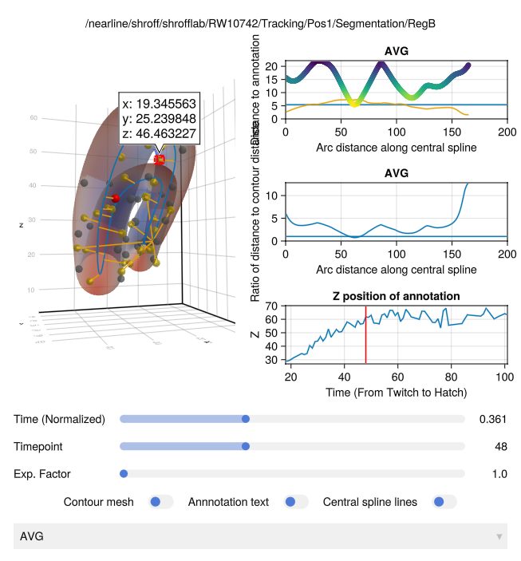

# ShroffCelegansModels

[](https://JaneliaSciComp.github.io/ShroffCelegansModels.jl/stable/)
[](https://JaneliaSciComp.github.io/ShroffCelegansModels.jl/dev/)
[](https://github.com/JaneliaSciComp/ShroffCelegansModels.jl/actions/workflows/CI.yml?query=branch%3Amain)

A Julia package for building, manipulating, and visualizing parametric 3D geometric models of *Caenorhabditis elegans* from light-sheet microscopy tracking data. Developed at the [Shroff Lab](https://www.janelia.org/lab/shroff-lab), Janelia Research Campus.

## Overview

ShroffCelegansModels.jl constructs smooth 3D surface models of *C. elegans* from seam cell and cross-section annotations produced by the lab's tracking pipeline. Each model represents the worm body as a central axis spline plus a set of transverse contour splines, enabling:

- **3D mesh generation** for interactive visualization via [Makie](https://docs.makie.org/)
- **Worm straightening** — untwisting the curved body into a canonical straight coordinate frame
- **Annotation mapping** — projecting 3D cell positions onto the straightened model
- **Population averaging** — computing a mean worm geometry across multiple animals or timepoints
- **Time series models** — tracking model geometry over the course of development

## Installation

This package is not yet registered in the Julia General registry. Install it directly from GitHub:

```julia
using Pkg
Pkg.add(url = "https://github.com/JaneliaSciComp/ShroffCelegansModels.jl")
```

> **Note:** The package depends on a development version of [ThinPlateSplines.jl](https://github.com/mkitti/ThinPlateSplines.jl) that is specified as a source dependency in `Project.toml`.

## Quick Start

```julia
using ShroffCelegansModels

# Build a model from a lattice CSV produced by the tracking pipeline
model = build_celegans_model("path/to/lattice_final/lattice.csv")

# Straighten the worm
smodel = ShroffCelegansModels.Types.StraightenedCelegansModel(model)

# Visualize with GLMakie
using GLMakie
fig = Figure()
ax = Axis3(fig[1,1])
mesh!(ax, model)
display(fig)
```

## Data Format

The package expects output from the Shroff lab *C. elegans* tracking pipeline:

```
<dataset>/
  Decon_reg_<timepoint>/
    Decon_reg_<timepoint>_results/
      lattice_final/
        lattice.csv          # Seam cell coordinates (left/right pairs, rows = cells)
      model_crossSections/
        latticeCrossSection_0.csv
        latticeCrossSection_1.csv
        ...
  cell_key.json              # Maps timepoints to developmental stages
```

`lattice.csv` contains alternating left/right seam cell rows. The package computes the central axis as the midpoint between left and right seam cells, then fits natural cubic splines through both the central axis and the transverse contour points.

## Model Types

| Type | Description |
|------|-------------|
| `CelegansModel` | Core model: central spline + vector of 3D transverse splines |
| `CachedCelegansModel` | Wraps `CelegansModel` with precomputed derivative and arc length |
| `StraightenedCelegansModel` | Untwisted model with the worm laid along the Z axis |
| `RadialCelegansModel` | Variant using 1D radial distance splines instead of 3D transverse splines |

All types share the `AbstractCelegansModel` interface:

```julia
central_spline(model)          # Parametric spline: [0,1] → Point3
transverse_spline(model, i)    # i-th contour spline
num_transverse_splines(model)  # Number of contour splines (typically 16 or 32)
model_length(model)            # Arc length of the central axis (in voxels)
```

## Key Functions

### Model Construction

```julia
# From a lattice CSV file path
model = build_celegans_model(path::String)

# From DataFrames of left/right seam cell coordinates
model = build_celegans_model(left_seam_cells, right_seam_cells, cross_sections, names)
```

### Straightening

```julia
smodel = StraightenedCelegansModel(model)
```

The straightened model maps the worm body to a canonical frame with the anterior–posterior axis along Z, enabling comparison across animals.

### Averaging

```julia
using StatsBase
avg_model = ShroffCelegansModels.average(smodels)

# Weighted average
avg_model = ShroffCelegansModels.average(smodels, weights)
```

### Annotation Mapping

```julia
# Find where 3D annotation points project onto the central spline
t_params, central_pts, distances = nearest_central_pt(model, annotation_points)
```



*Debug visualization showing annotation positions projected along the anterior–posterior axis: distance to contour (top), ratio of distances (middle), and Z position over time (bottom).*

### Visualization

The package extends Makie's `mesh!` recipe to accept any `AbstractCelegansModel`:

```julia
using GLMakie
mesh!(ax, model)                           # Twisted model
mesh!(ax, smodel; transform_points = swapyz)  # Straightened, axes reoriented
```

## Dataset Utilities

```julia
using ShroffCelegansModels.Datasets

# Load a dataset (auto-detects cell_key.json or CellKey.csv)
ds = Dataset("/path/to/dataset")

# Access the timepoint range
timerange = range(ds.cell_key)
```

## Scripts

Utility scripts in `scripts/` include:

| Script | Purpose |
|--------|---------|
| `meshscatter_all.jl` | Render all timepoints as mesh scatter plots |
| `meshscatter_average.jl` | Render the average model |
| `extract_colors.jl` | Extract color annotations from segmentation data |
| `find_left_right_flips.jl` | Detect and report left/right annotation flips |
| `launch_show_average_annotations.jl` | Launch interactive average annotation viewer |

## Dependencies

Key dependencies include [BSplineKit.jl](https://github.com/jipolanco/BSplineKit.jl) for spline interpolation, [Makie.jl](https://github.com/MakieOrg/Makie.jl) for visualization, [GeometryBasics.jl](https://github.com/JuliaGeometry/GeometryBasics.jl) for mesh types, [HDF5.jl](https://github.com/JuliaIO/HDF5.jl) and [TiffImages.jl](https://github.com/tlnagy/TiffImages.jl) for image I/O, and [ThinPlateSplines.jl](https://github.com/mkitti/ThinPlateSplines.jl) for thin plate spline warping.

## Citation

If you use this software in your research, please cite the relevant Shroff Lab publications and acknowledge the Janelia Research Campus.

## License

See [LICENSE](LICENSE) for details.
